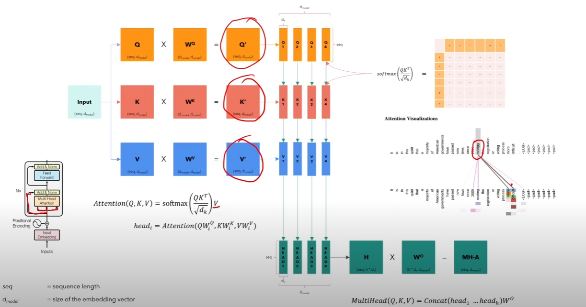
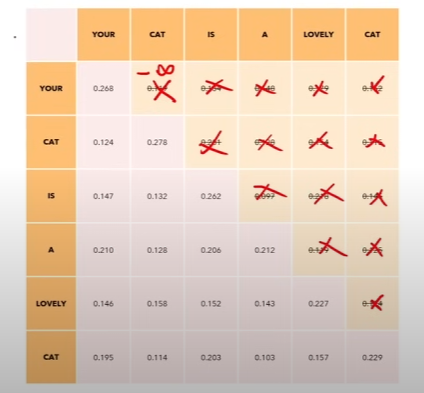
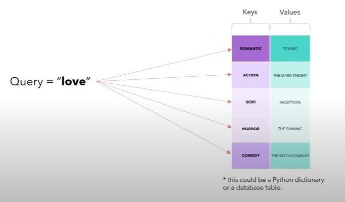

# Transformer
Implement transformer, here is the original [paper](paper/transformer_paper.pdf).

## Input Embedding
Turn each token into an embedding. For instance, each token has an embedding of 512.

## Positional Encoding
The goal is to let each word carry some positional information in the sentence. 
So that, we understand some words are "close" and some words are "distant".

  PE(pos, 2i) = sin(pos / 100002i/d_model) 
  PE(pos, 2i+1) = cos(pos / 100002i/d_model)

- pos: position of the token in the sentence
- i: index of the embedding number
- PE(0, 10): 
  - The positional encoding of the first token in the sentence
  - The positional encoding of the 10th number in its vector.

* We only compute positional encoding once, then re-use for training or inference.

## Attention
It describes how each word relates to other words in a sentence.

  Attention(Q, K, V) = softmax((QKT) / √dk) * V

Where:
- <code>Q</code> is the matrix of queries. (assuming 6 * 512)
- <code>K</code> is the matrix of keys. (assuming 6 * 512)
- <code>V</code> is the matrix of values. (assuming 6 * 512)
- <code>dk</code> is the dimensionality of the keys. (assuming 512)

### Break-Down

  softmax((QKT) / √dk)

Given Q and K are (6, 512). Thus, the result has format (6, 6), indicating how each word relates to other words.

  softmax((QKT) / √dk) * V

Given the result of softmax is (6, 6), and V is (6, 512). The result has format (6, 512). Indicating that

- We captured the embedding (meaning), the positional embedding
- We captured word's interactions

## Multi-Attention
In a Multi-Attention approach, we split the embedding 512 into `n_heads` parts. Each part is fed into one `Self-Attention`.

We want each head to watch different aspects of the sentence.

*Figure 1: Multi-Attention. Source: [Umar Jamil, 2023](https://www.youtube.com/watch?v=bCz4OMemCcA)*

## Masked Multi-Attention
The goal is to make the model depend on only the past words. Meaning that all future words will have a weight `-inf` which softmax will replace with 0.

In transformer, we mask the result of Q @ KT, in which all values above the diagonal are replaced with `-inf`

*Figure 2: Mask. Source: [Umar Jamil, 2023](https://www.youtube.com/watch?v=bCz4OMemCcA)*

## Q, K, V
- Q: Query
- K: Keys
- V: Values

Imagine `K` contains main characteristics of `V`. For instance Titanic is a romantic movie. And we would like to search `Love` movies.

- softmax((QKT) / √dk): Softmax returns a probability distribution (how much focus / attention should be placed on each word), in which `Romantic` is most likely related to `Love`
- softmax((QKT) / √dk) * V: The Values corresponding to the Keys that match the Query were weighted by the attention score, to produce the final output

*Figure 3: Q, K, V. Source: [Umar Jamil, 2023](https://www.youtube.com/watch?v=bCz4OMemCcA)*

## Layer Normalization
Normalize each sample independently, all values between 0 and 1, variance be 1.